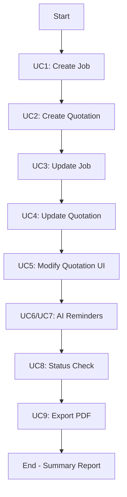

# Use Case Test Suite

This directory contains comprehensive test coverage for all use cases defined in the Job & Quotation Management System.

## 📚 Reference Document

All tests are based on: `docs/Use Cases Doc: Job & Quotation.md`

## 🧪 Test Files Overview

| Test File | Use Case | Description | Test Count |
|-----------|----------|-------------|------------|
| `test_uc1_create_job.py` | UC1 | Create Job | 1 |
| `test_uc2_create_quotation.py` | UC2 | Create Quotation | 3 |
| `test_uc3_update_job_info.py` | UC3 | Update Job Info | 3 |
| `test_uc4_update_quotation_info.py` | UC4 | Update Quotation Info | 4 |
| `test_uc5_modify_quotation_ui.py` | UC5 | Modify Quotation (in UI) | 4 |
| `test_uc6_uc7_ai_reminders.py` | UC6 & UC7 | AI Reminders (Jobs & Quotations) | 4 |
| `test_uc8_status_check.py` | UC8 | Weekly/Monthly Status Check | 5 |
| `test_uc9_export_quotation_pdf.py` | UC9 | Export Quotation PDF | 6 |

**Total: 30+ individual test cases**

## 🚀 Running Tests

### Run All Tests
```bash
python test/run_all_use_case_tests.py
```

### Run Individual Use Case Tests
```bash
# UC1 - Create Job
python test/test_uc1_create_job.py

# UC2 - Create Quotation
python test/test_uc2_create_quotation.py

# UC3 - Update Job Info
python test/test_uc3_update_job_info.py

# UC4 - Update Quotation Info
python test/test_uc4_update_quotation_info.py

# UC5 - Modify Quotation (in UI)
python test/test_uc5_modify_quotation_ui.py

# UC6 & UC7 - AI Reminders
python test/test_uc6_uc7_ai_reminders.py

# UC8 - Weekly/Monthly Status Check
python test/test_uc8_status_check.py

# UC9 - Export Quotation PDF
python test/test_uc9_export_quotation_pdf.py
```

## 📋 Test Coverage by Use Case

### UC1 - Create Job
- ✅ Basic job creation with client and project info
- ✅ System generates unique Job No.
- ✅ Job record saved with Active status

### UC2 - Create Quotation
- ✅ Create quotation for existing job
- ✅ **E1**: Auto-create job if none exists
- ✅ **E2**: Multiple quotations for same job

### UC3 - Update Job Info
- ✅ Update basic job information
- ✅ Update client contact information
- ✅ **Extend UC6**: AI reminder for related jobs

### UC4 - Update Quotation Info
- ✅ Update quotation amount
- ✅ Update quotation description and terms
- ✅ Update customer information
- ✅ **Extend UC7**: AI reminder for related quotations

### UC5 - Modify Quotation (in UI)
- ✅ Modify quotation and create new version
- ✅ **E1**: System generates version numbers (V1/V2/V3)
- ✅ **E2**: Compare differences and preserve old versions
- ✅ AI marks old version as cancelled

### UC6 & UC7 - AI Reminders
#### UC6 - Related Job Reminders
- ✅ AI detects same-client jobs and reminds user
- ✅ No reminder when no related jobs exist

#### UC7 - Related Quotation Reminders
- ✅ AI detects multiple quotations under same job
- ✅ AI identifies consistency issues

### UC8 - Weekly/Monthly Status Check
- ✅ Generate weekly status report
- ✅ Generate monthly status report
- ✅ Highlight abnormal projects
- ✅ Export report to CSV/Excel
- ✅ Notify accountant after report generation

### UC9 - Export Quotation PDF (Read-only)
- ✅ Basic PDF export
- ✅ Verify export does not modify original data
- ✅ AI validates latest version
- ✅ Export specific version
- ✅ Export with custom filename
- ✅ Batch export multiple quotations

## 🏗️ Test Architecture

All tests follow the same structure:

```python
def test_uc_scenario():
    """Test description"""
    session_id = str(uuid.uuid4())

    # Setup: Create necessary data
    setup_request = UserRequest(message=..., session_id=session_id)
    setup_result = main_flow(setup_request)

    # Action: Perform the test action
    test_request = UserRequest(message=..., session_id=session_id)
    test_result = main_flow(test_request)

    # Verify
    assert test_result is not None
    print("✅ Test passed")
```

## 🔍 Key Features Tested

### Core Functionality
- Job creation and management
- Quotation creation and management
- Data updates and modifications
- Version control
- PDF export

### AI Features
- Duplicate client detection
- Related job/quotation reminders
- Consistency checks
- Version validation
- Automated status reporting

### Data Integrity
- Read-only exports
- Version preservation
- Modification logging
- Batch operations

## 📊 Test Execution Flow



## 🛠️ Maintenance

### Adding New Tests
1. Create a new test file: `test_ucX_description.py`
2. Follow the existing test structure
3. Add the test module to `run_all_use_case_tests.py`
4. Update this README

### Test Naming Convention
- File: `test_uc{number}_{description}.py`
- Function: `test_uc{number}_{scenario}()`
- Extensions: `test_uc{number}_e{extension_number}_{scenario}()`

## 📝 Notes

- All tests use unique `session_id` to ensure isolation
- Tests use realistic Chinese and English client names
- Each test is independent and can run standalone
- Tests verify AI behavior and automation features
- No test modifies shared state

## 🎯 Success Criteria

A test passes if:
1. ✅ No exceptions raised
2. ✅ Expected result is not None
3. ✅ AI automation features work as expected
4. ✅ Data integrity maintained

## 🔗 Related Files

- **Use Case Documentation**: `/docs/Use Cases Doc: Job & Quotation.md`
- **Main Flow**: `/main_flow/main_flow.py`
- **Finance Agent**: `/app/finance_agent/`
- **Test Runner**: `/test/run_all_use_case_tests.py`

---

**Last Updated**: 2025-10-25
**Test Coverage**: 9 Use Cases, 30+ Test Scenarios
**Status**: ✅ All tests implemented
